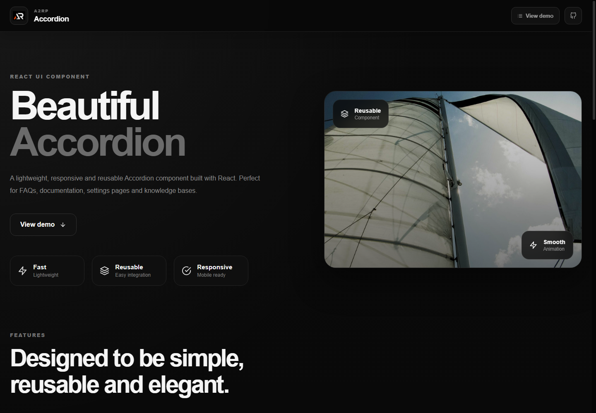
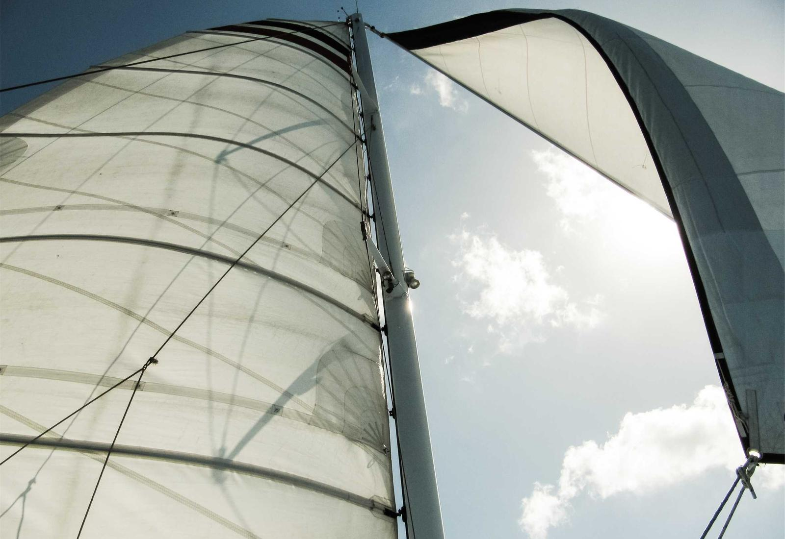
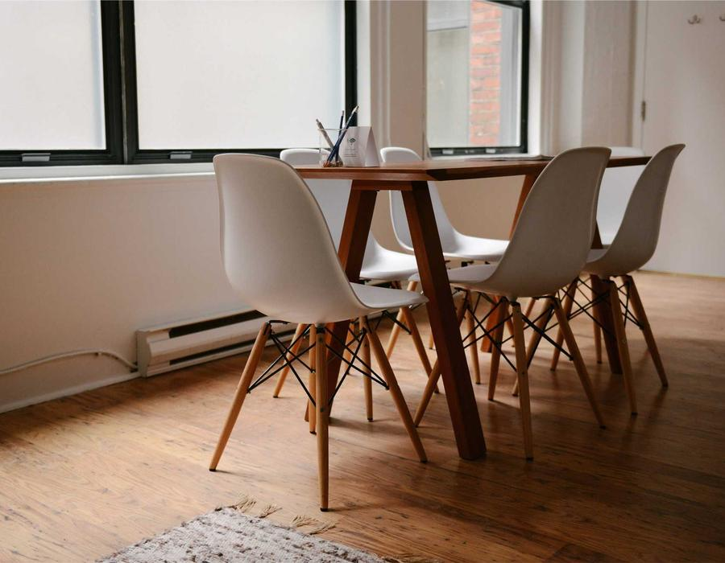
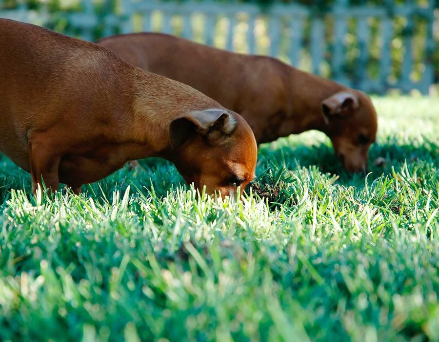

# Accordion

A polished React Accordion component for FAQs, documentation, settings pages and knowledge bases. It demonstrates a data-driven accordion, local CSS Modules styling, direct section navigation and a responsive dark interface.

## Features

- Single-item expand and collapse interaction
- Keyboard-friendly accordion controls
- Scroll-aware fixed header with a small-screen menu
- Header hides while scrolling down and returns while scrolling up
- Direct section navigation without fixed-header overlap
- Icon-only footer links with tooltips and a dynamic copyright year
- Local image assets, social preview and accessible labels
- Responsive layout for desktop, tablet and mobile

The FAQ content is maintained in `src/data/faq.js`, while each component keeps its styles in a matching CSS Module.

## Tech stack

- React
- Vite
- JavaScript
- CSS Modules
- React Icons

## Run locally

```bash
npm install
npm run dev
```

Create a production build with `npm run build`.

## Live demo

[https://a2rp.github.io/accordion/](https://a2rp.github.io/accordion/)

Deploy with:

```bash
npm run deploy
```

## Project visuals

- Home screen: 
- Hero visual: 
- Reusable component visual: 
- Smooth transitions visual: 
- Responsive layout visual: 
- Accessible controls visual: 

## Future prospects

- Support controlled open state and multiple open items
- Add optional search and filtering for larger FAQ collections
- Offer theme variants and a small reusable component API

## Links

- Portfolio: [https://www.ashishranjan.net/](https://www.ashishranjan.net/)
- GitHub: [https://github.com/a2rp](https://github.com/a2rp)
- CodePen: [https://codepen.io/ash1198](https://codepen.io/ash1198)
- LinkedIn: [https://www.linkedin.com/in/aashishranjan](https://www.linkedin.com/in/aashishranjan)
- Facebook: [https://www.facebook.com/theash.ashish/](https://www.facebook.com/theash.ashish/)
- YouTube: [https://www.youtube.com/@ashishranjan-ashz?sub_confirmation=1](https://www.youtube.com/@ashishranjan-ashz?sub_confirmation=1)
- Email: [ash.ranjan09@gmail.com](mailto:ash.ranjan09@gmail.com)

## Support

- Support: [https://a2rp-donation-page.netlify.app/](https://a2rp-donation-page.netlify.app/)
- Buy Me a Coffee: [https://buymeacoffee.com/a2rp](https://buymeacoffee.com/a2rp)
- Patreon: [https://patreon.com/a2rp](https://patreon.com/a2rp)

## License

MIT License
