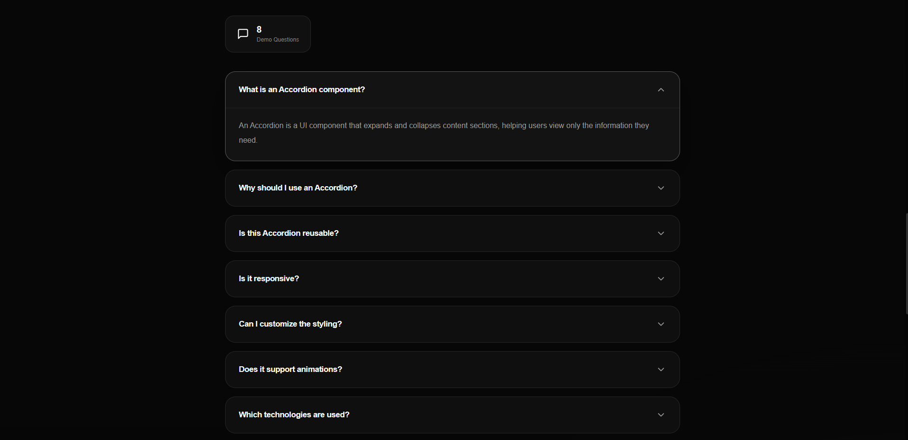

# Accordion

A lightweight, responsive, and reusable Accordion component built with React, Vite, and styled-components.

Perfect for FAQs, help centers, documentation, settings pages, and knowledge bases.

## Preview



## Features

- Responsive design
- Smooth expand and collapse animation
- React Icons
- JSON based data
- Reusable component
- Clean UI
- Dark theme
- Keyboard accessible
- Easy to customize

## Tech Stack

- React
- Vite
- Styled Components
- React Icons
- JavaScript

## Run Locally

```bash
npm install
npm run dev
```

## Build

```bash
npm run build
```

## Deploy

```bash
npm run deploy
```

## Author

**Ashish Ranjan**

- Portfolio: https://www.ashishranjan.net
- GitHub: https://github.com/a2rp
- CodePen: https://codepen.io/ash1198
- LinkedIn: https://www.linkedin.com/in/aashishranjan
- Facebook: https://www.facebook.com/theash.ashish/
- YouTube: https://www.youtube.com/@ashishranjan-ashz?sub_confirmation=1
- Email: mailto:ash.ranjan09@gmail.com

## Support

- Support: https://a2rp-donation-page.netlify.app/
- Buy Me A Coffee: https://buymeacoffee.com/a2rp
- Patreon: https://patreon.com/a2rp

## License

MIT License
